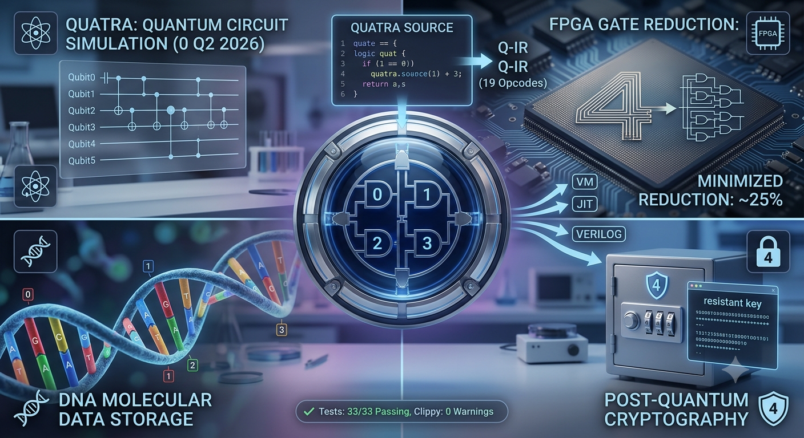

# QUATRA - Quaternary Functional Tensor Language

A functional programming language based on base-4 logic for quantum simulation, FPGA hardware, and DNA synthesis.



## Features

- **4-State Logic**: Zero(0), One(1), Super(2), Error(3)
- **Multiple Backends**:
  - Interpreter & Chimera VM
  - JIT (via Cranelift)
  - Verilog FPGA (4-state hardware)
  - DNA Assembly Pipeline (A,C,G,T)
- **Q-IR**: Intermediate representation with 19 opcodes (magic: 0x49 0x52 0x02)

## Quick Start

```bash
git clone https://github.com/jomaco13/quatra-lang
cd quatra-lang
cargo build --features jit

# Run a program
cargo run -- run examples.q

# Generate FPGA Verilog
cargo run -- verilog examples.q

# Generate DNA sequence
cargo run -- dna examples.q

# Native JIT compilation
cargo run --features jit -- native examples.q
```

## Language Syntax

```quatra
-- Function definition
fun add(a, b) = a <+> b

-- Let binding with collapse
fun main() =
  let x = 2 in         -- Super state
  collapse (~~x)        -- Triple NOT + collapse -> One
```

## Operators

| Operator | Function | Description |
|----------|---------|-------------|
| `<+>` | QAdd | Quaternary addition (modular) |
| `<*>` | QMul | Quaternary multiplication |
| `~~` | QNot | NOT rotation (0→1→2→3→0) |
| `collapse` | - | Super→One, Error→Zero |

## Use Cases

- **Quantum Simulation**: 4-state quantum circuit modeling
- **FPGA Hardware**: Direct 4-state logic synthesis
- **DNA Computing**: Molecular algorithm storage
- **Neuromorphic AI**: 4-state neural activation

## Documentation

- [Phase 4 Implementation](docs/Phase4.md)
- [Implementation Status](docs/IMPLEMENTATION_STATUS.md)
- [Research Report](docs/RESEARCH_REPORT.md)
- [Maintenance Guide](MAINTENANCE.md)

## Status

[]()
[]()
[]()

## Backends

| Backend | Command | File |
|---------|---------|------|
| ASM | `quatra compile` | `src/codegen.rs` |
| Interpreter | `quatra run` | `src/interpreter.rs` |
| Chimera VM | `quatra vm` | `src/vm/interpreter.rs` |
| Q-IR | `quatra qir` | `src/qir.rs` |
| JIT | `quatra native` | `src/jit.rs` |
| Verilog | `quatra verilog` | `src/verilog.rs` |
| DNA | `quatra dna` | `src/dna_assembly.rs` |

## Examples

See `examples.q` and `tests/samples/*.q` for working QUATRA programs.